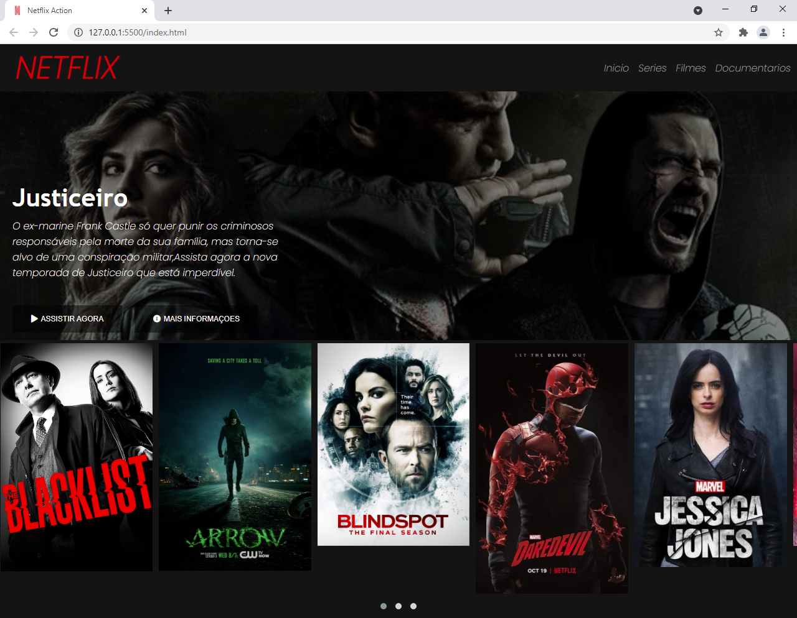

<h1 align="center">
    
</h1>

<h4 align="center"> 
  Netflix Clone
</h4>

 <a href="#-sobre-o-projeto">Sobre</a> • 
 <a href="#-tecnologias">Tecnologias</a> 

## 💻 Sobre o projeto

🚀 Netflix 

Projeto desenvolvido durante **O Curso da Digital Innovation One**

#### Alterações

 - Inserido links nas imagens para visualizar trailer dos filmes

---

## 🛠 Tecnologias

As seguintes ferramentas foram usadas na construção do projeto:

#### **Website** ([HTML](https://www.w3schools.com/html/))

- **[HTML](https://www.w3schools.com/html/)**
- **[CSS](https://www.w3schools.com/css/)**
- **[JQuery](https://jquery.com/)**
- **[TMDB](https://www.themoviedb.org/?language=pt)**

#### **Utilitários**

- Protótipo: **[Netflix](https://www.netflix.com/)**
- API: **[Imagens](https://www.themoviedb.org/?language=pt)**
- Editor: **[Visual Studio Code](https://code.visualstudio.com/)**
- Markdown: **[StackEdit](https://stackedit.io/)**, **[Markdown Emoji](https://gist.github.com/rxaviers/7360908)**
